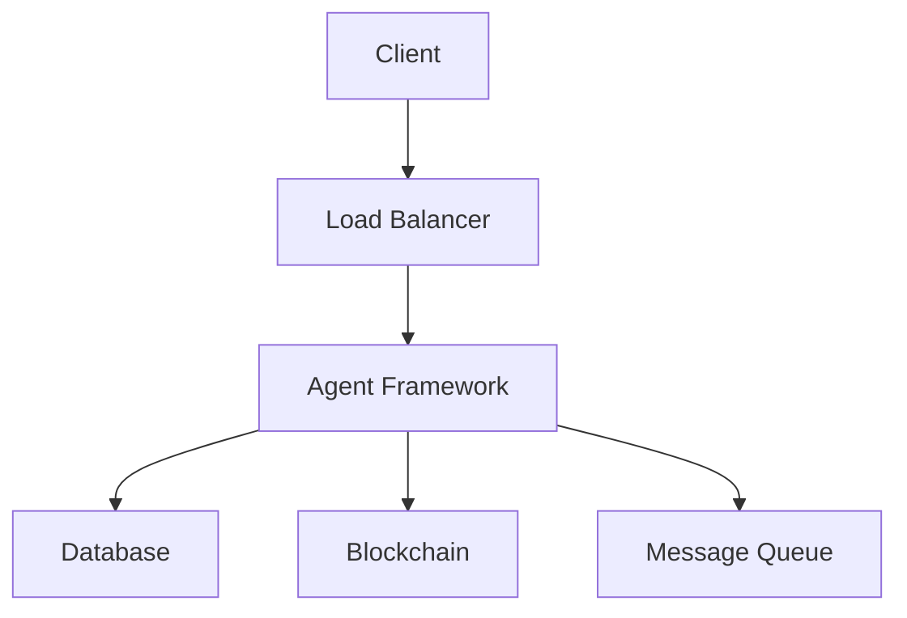
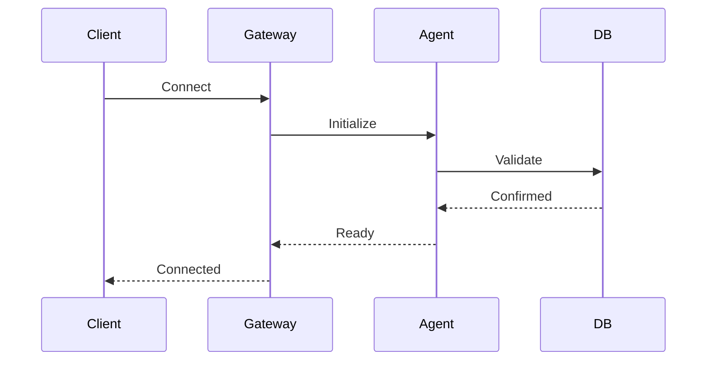
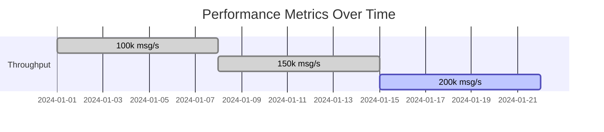
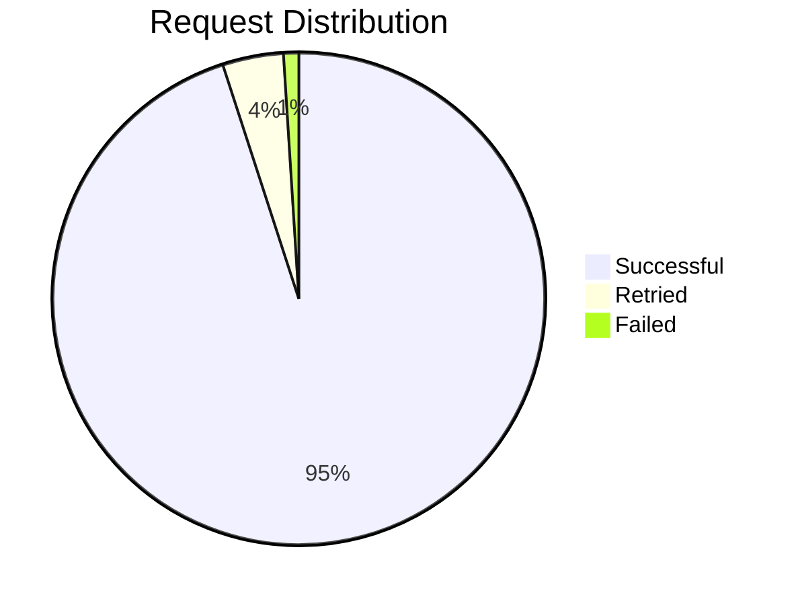
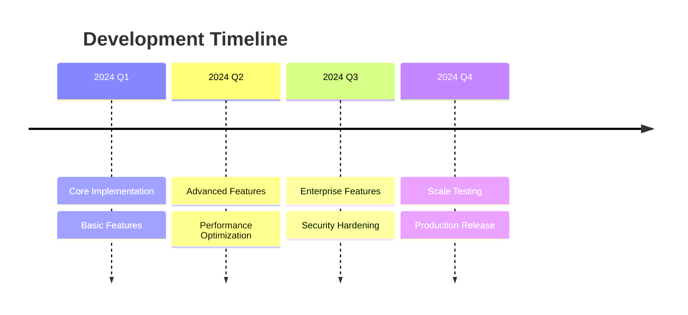
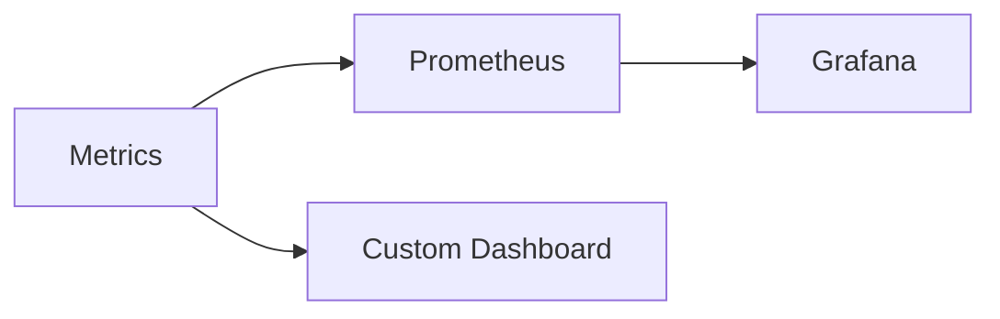

# Bee Swarm

[](https://www.rust-lang.org)
[](https://github.com/username/agent-framework/actions)
[](https://crates.io/crates/agent-framework)
[](https://docs.rs/agent-framework)
[](LICENSE)

High-performance distributed agent system WIP framework built in Rust, designed for scalability and real-time operations.

## Performance Metrics

| Metric | Value |
|--------|-------|
| Latency (p95) | < 10ms |
| Throughput | 100k msg/s |
| Memory Usage | < 100MB |
| CPU Usage | < 5% |



## System Architecture



## Features Overview

### Core Components
- **High-Performance Runtime**
  - Async-first architecture
  - Multi-threading support
  - Zero-copy data handling
  
- **Real-time Communication**
  - WebSocket support
  - Binary protocol
  - Automatic reconnection

- **Data Management**
  - NoSQL integration
  - Automatic scaling
  - Data replication

### Performance Graph



## Quick Start

```bash
# Installation
curl -sSf https://install.framework.dev | sh

# Start the server
framework start --config default.yaml

# Run a test agent
framework agent create --type worker
```

## Code Examples

### Basic Agent Setup

```rust
use agent_framework::{Agent, Config};

#[tokio::main]
async fn main() {
    let config = Config::default();
    let agent = Agent::new(config).await?;
    
    agent.start().await?;
}
```

### Custom Processing Logic

```rust
#[async_trait]
impl Handler for CustomHandler {
    async fn process(&self, data: Data) -> Result<Output> {
        // Custom processing logic
        Ok(processed_data)
    }
}
```

## System Requirements

| Component | Minimum | Recommended |
|-----------|---------|-------------|
| CPU | 2 cores | 4+ cores |
| RAM | 4GB | 8GB+ |
| Storage | 20GB | 50GB+ |
| Network | 100Mbps | 1Gbps |

## Benchmarks



## Development Roadmap



## Deployment Options

### Docker

```bash
docker pull framework/agent-system:latest
docker run -p 8080:8080 framework/agent-system
```

### Kubernetes

```yaml
apiVersion: apps/v1
kind: Deployment
metadata:
  name: agent-framework
spec:
  replicas: 3
  template:
    spec:
      containers:
      - name: agent-framework
        image: framework/agent-system:latest
```

## Monitoring



## Performance Optimization

| Technique | Impact |
|-----------|--------|
| Zero-copy | -30% latency |
| Connection pooling | +50% throughput |
| Binary protocol | -40% bandwidth |
| Async processing | +70% concurrency |

## Security Features

- TLS 1.3 encryption
- JWT authentication
- Role-based access control
- Audit logging
- Rate limiting

## API Reference

### REST Endpoints

| Endpoint | Method | Description |
|----------|--------|-------------|
| `/agents` | GET | List all agents |
| `/agents/{id}` | GET | Get agent details |
| `/agents` | POST | Create new agent |
| `/metrics` | GET | System metrics |

### WebSocket Events

| Event | Direction | Purpose |
|-------|-----------|----------|
| `connect` | Client -> Server | Initialize connection |
| `status` | Server -> Client | Agent status updates |
| `data` | Bidirectional | Data exchange |

## Contributing

Read our [Contributing Guide](CONTRIBUTING.md) for details on:

- Code style
- Commit messages
- Pull requests
- Development setup

## License

MIT License - see [LICENSE](LICENSE) for details.
This work is WIP.


---

**Note**: Replace placeholder URLs, usernames, and images with actual content before deployment.
